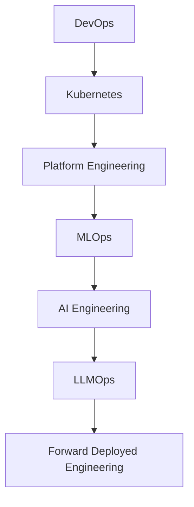

<div align="center">


</div>

<div align="center">

[](https://git.io/typing-svg)

</div>

---

# 👨‍💻 About Me

```yaml
name: Bittu Sharma
location: Noida, India

current_role:
  - DevOps Engineer
  - MLOps Engineer

experience:
  - 2+ Years

specialization:
  - Cloud Infrastructure
  - Kubernetes
  - CI/CD Automation
  - Platform Engineering
  - MLOps

currently_learning:
  - AI Engineering
  - Agentic AI
  - Enterprise RAG
  - LLMOps
  - Forward Deployed Engineering

goal:
  Become a world-class AI Engineer and Forward Deployed Engineer
  by combining DevOps, MLOps, Platform Engineering and AI.
```

---

# 🚀 Tech Arsenal

<div align="center">

### DevOps & Cloud


### Programming & MLOps


</div>

---

# ⚡ Engineering Evolution

```text
                    ┌───────────────────────┐
                    │  Forward Deployed     │
                    │      Engineer         │
                    └──────────▲────────────┘
                               │
                    ┌──────────┴────────────┐
                    │     AI Engineer       │
                    └──────────▲────────────┘
                               │
                    ┌──────────┴────────────┐
                    │    MLOps Engineer     │
                    └──────────▲────────────┘
                               │
                    ┌──────────┴────────────┐
                    │    DevOps Engineer    │
                    └───────────────────────┘
```

---

# 🎯 Current Focus

<div align="center">

| Domain | Progress |
|---------|----------|
| DevOps | ████████████████████ 100% |
| Kubernetes | ███████████████████░ 95% |
| AWS Cloud | ███████████████████░ 95% |
| Platform Engineering | ██████████████████░ 90% |
| MLOps | ██████████████████░ 90% |
| AI Engineering | ███████████████░░░░ 75% |
| LLMOps | ██████████████░░░░░░ 70% |
| Forward Deployed Engineering | ████████████░░░░░░░ 60% |

</div>

---

# 🏗️ What I'm Building

<table>
<tr>
<td width="50%">

### ☁️ Cloud Platforms
- AWS Infrastructure
- Kubernetes Clusters
- GitOps Workflows
- Infrastructure Automation

</td>

<td width="50%">

### 🚀 MLOps Platforms
- ML Pipelines
- Model Deployment
- Experiment Tracking
- Model Monitoring

</td>
</tr>

<tr>
<td width="50%">

### 🤖 AI Applications
- RAG Systems
- AI Assistants
- AI Agents
- Knowledge Platforms

</td>

<td width="50%">

### ⚡ Platform Engineering
- Internal Developer Platforms
- Self-Service Infrastructure
- CI/CD Platforms
- Observability Platforms

</td>
</tr>
</table>

---

# 📊 GitHub Analytics

<div align="center">


</div>

<div align="center">


</div>

---

# 🌌 Learning Roadmap



---

# 🌐 Connect

<div align="center">

<a href="https://github.com/bittush8789">

</a>

<a href="https://bittublog.hashnode.dev">

</a>

</div>

---

<div align="center">

## 💡 Philosophy

### "Build reliable platforms today. Build intelligent systems tomorrow."

🚀 DevOps → MLOps → AI Engineering → Forward Deployed Engineering

</div>


